* * *

Dedicate MMO server (Digital Ocean)
===================================

This is example to dedicate server via [Digital Ocean](https://m.do.co/c/03d10d801aee), with MySQL database

There is old video tutorial to dedicate server ([Link](https://www.youtube.com/watch?v=1CGRlHGDu8U))

* * *

### Create Droplet

First, Let's Create a droplet

*   Click **Create → Droplets** menu  
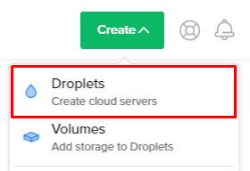

*   Click **One-click apps** tab  
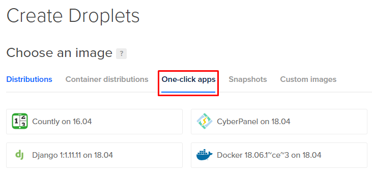

*   Choose **PhpMyAdmin** app  
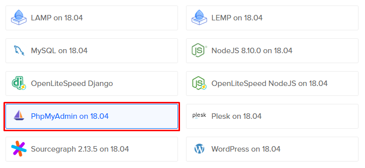

*   Choose size as you wish  


*   Choose data center as you wish  


*   Choose host name as you wish  
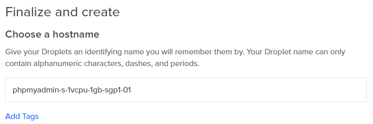

*   Press **Create** button  


* * *

### Login to server and prepare database

*   Then after droplet created it will send information to your email, copy it, we will use it to login via SSH client  


*   Login to the server by SSH client (For Windows you can use Putty, For Mac you can use Terminal) with copied password. Then it will request you to change password, change it as you wish  
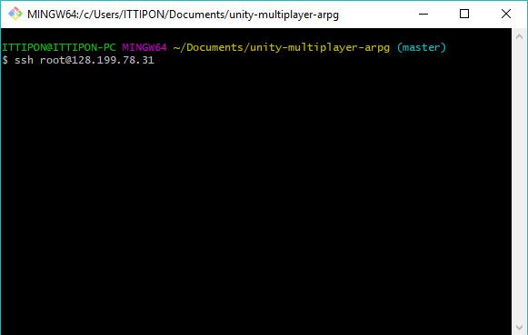

*   After logged in enter command `nano /root/.digitalocean_password` to read password

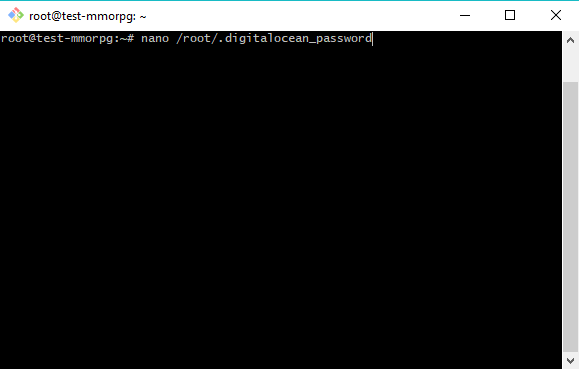

*   Copy admin password, we will use it to login to **PhpMyAdmin** to manage database

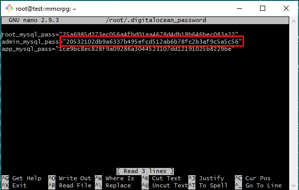

*   Go to **PhpMyAdmin** website: `{server address}/phpmyadmin`, for this server address is 128.199.78.31 so go to **PhpMyAdmin** website at `http://128.199.78.31/phpmyadmin`, then login with username `admin` and copied admin password  
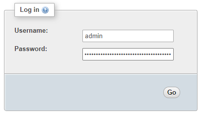

*   Then we are going to create database and import tables data, Click **Database** menu  
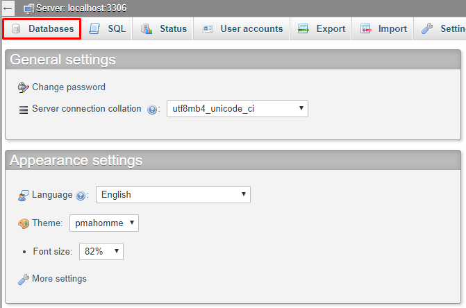

*   Then enter database name and press **Create**  


*   Click **Import** menu  
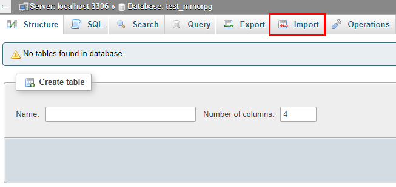

*   Click **Choose File** button  
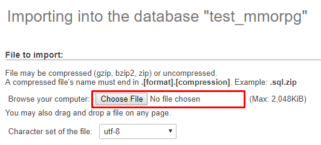

*   Click select **mysql_main.sql** from `{your project folder}/Assets/UnityMultiplayerARPG/MMO/SQLs/`  
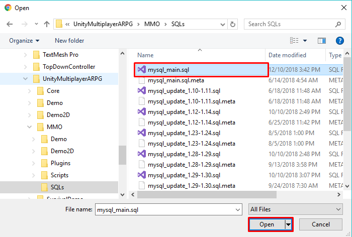

*   Scroll down and click **Go** button  
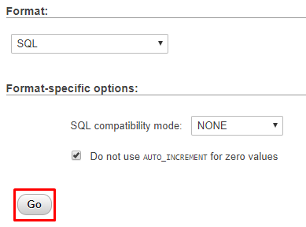

* * *

### Build and prepare configs

Then we're going to build the server and upload it

*   Build server files from menu **File → Build Settings...** then change target platfrom to Linux, set arhitecture to x86_64, turn on server mode (or headless mode for older Unity). Then build it  
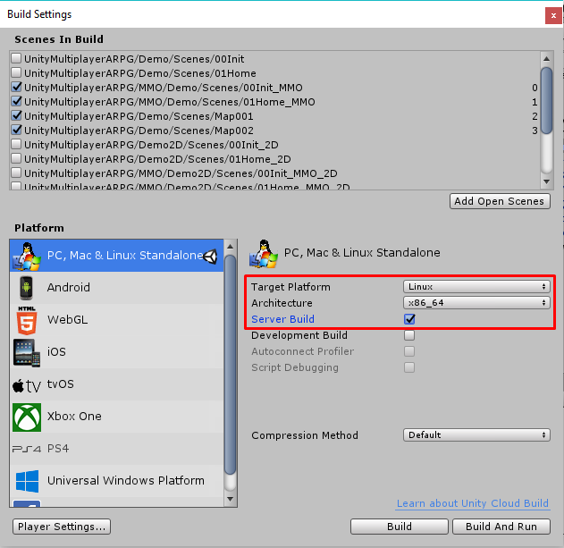

*   After server files built, prepare config files at where server files located by create folder named `config` then create 2 files named `serverConfig.json` and `mySqlConfig.json`  


*   `serverConfig.json` content:  

The "databaseOptionIndex"  in the serverconfig file indicates which Database type we want to use,
0 = Sqlite Database
1 = Mysql Database
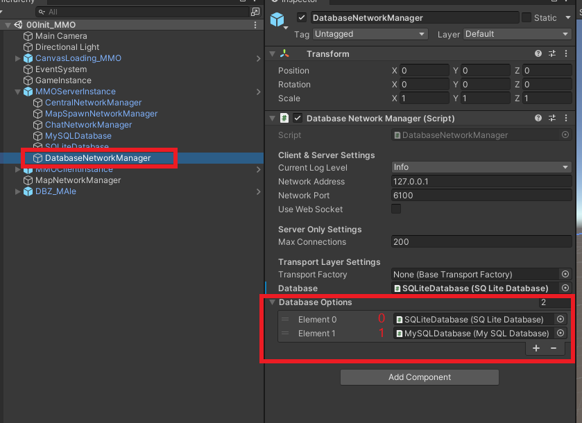

```
{
    "databaseOptionIndex" : 1,
  
    "centralAddress" : "128.199.78.31",
    "centralPort" : 7000,
    "centralMaxConnections" : 600,
    "machineAddress" : "128.199.78.31",

    "mapSpawnPort" : 3001,
    "mapSpawnMaxConnections" : 100,
    "spawnExePath" : "/root/Build.x86_64",
    "notSpawnInBatchMode" : false,
    "spawnStartPort" : 8000,
    "spawnMaps" : ["Map001", "Map002"],
    
    "mapMaxConnections" : 1000,

    "chatPort" : 3002,
    "chatMaxConnections" : 1000

    "databaseManagerAddress" : "localhost",
    "databaseManagerPort" : 6003
}
```
Set `centralAddress` and `machineAddress` to `128.199.78.31` because it is server address, set `spawnExePath` to `/root/Build.x86_64` because I going to upload server files to this path

*   `mySqlConfig.json` content:  
```
{
    "mySqlAddress" : "localhost",
    "mySqlPort" : 3306,
    "mySqlUsername" : "admin",
    "mySqlPassword" : "20532102db9a6337b495efcd512ab6b78fc2b3af9c5a5c56",
    "mySqlDbName" : "test_mmorpg"
}
```

* * *

### Upload and run server

*   Then upload server files, I use [FileZilla](https://filezilla-project.org/) to do it, login as SFTP, port 22 with root and its password (that you have set when login to server by SSH client)  
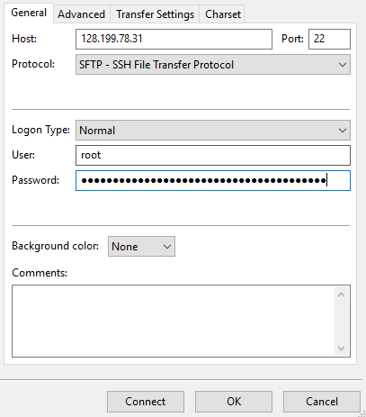

*   Upload server files and configs to server. Then after files uploaded, set permission for server execution file to `744`  
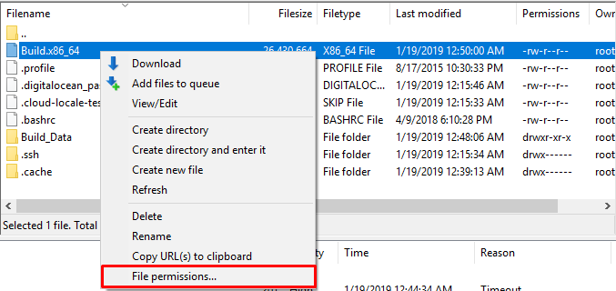
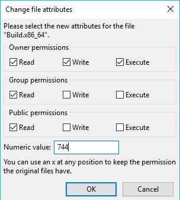

*   Then allow ports to make clients able to connect to servers


*   Then run the server with command `/root/Build.x86_64 -startCentralServer -startChatServer -startMapSpawnServer -startDatabaseServer`
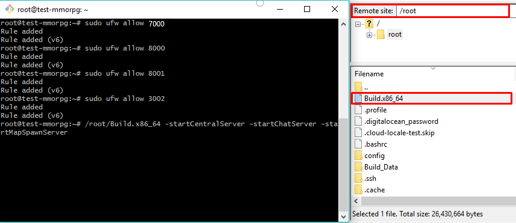

*   Then you can test connection by change `Network Address` to server address  
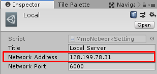

*   If it can connect, go back to SSH client, close servers by press CRTL + C then run server with command `nohup /root/Build.x86_64 -startCentralServer -startChatServer -startMapSpawnServer -startDatabaseServer &` you can learn about nohup command from this [link](https://www.ibm.com/support/knowledgecenter/en/ssw_aix_72/com.ibm.aix.cmds4/nohup.htm)
