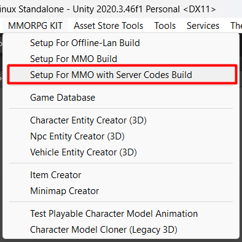

# Getting Started (MMO)

**Before reading this you should read [Getting Started](./101-getting-started-singleplayer-lan.md) first from step 1–2**

* * *

* Before start building, you have to do this: Click on menu `MMORPG KIT` -> `Setup For MMO with Server Codes Build`



* MMO mode demo is located at `/UnityMultiplayerARPG/MMO/Demo/Scenes/`, add MMO demo scenes to Build Settings dialog and move `00Init_MMO` to top of list.


* Then choose platforms, Windows or Linux or Mac as you wish but its architecture must be `x86_64`.

* Then build it.

* Then we're going to setup to run the game as game server.

For `Windows`, go to folder that you build the game create shortcut of execution file (.exe), then right click the shortcut select `Properties` then add following arguments at `Target` field

```
-startMapSpawnServer
-spawnExePath "Path of your execution file such as C:\Game\Game.exe"
-startCentralServer
-startDatabaseServer
```

If you are going to test on LAN you should set machine address to your LAN address by the command

```
-machineAddress "Address to your machine"
```

So for example, If you build the game to `D:/MMO/MMO.exe` and my LAN address is `192.168.1.102` I will set value in shortcut's `Target` field to:

```
D:\MMO\MMO.exe -startMapSpawnServer -spawnExePath "D:\MMO\MMO.exe" -startCentralServer -startDatabaseServer -machineAddress "192.168.1.102"
```

May see this video for example of how to set shortcut's `Target` field (It's not set machine address so it can run locally only)

[https://www.youtube.com/watch?v=7V1ChDPY\_Ww](https://www.youtube.com/watch?v=7V1ChDPY_Ww)


Then run the game from the short cut


If it's running like image above it mean that it's running correctly

* * *

For `Mac OSX`, use `Terminal` go to path where you build the game such as `/Game/` then enter command like this:

```
$ ./Game.app/Contents/MacOS/<productName> -startMapSpawnServer -spawnExePath "Path of your execution file such as /Game/Game.app/Contents/MacOS/<productName>" -startCentralServer -startDatabaseServer -machineAddress "192.168.1.102"
```

** **<productName> is `Product Name` settings which can find in `Unity Editor -> Player Settings`** **

* * *

For `Linux`, use `Terminal` go to path where you build the game such as `/Game/` then enter command like this:

```
$ ./Game.x86_64 -startMapSpawnServer -spawnExePath "Path of your execution file such as /Game/Game.x86_64" -startCentralServer -startDatabaseServer -machineAddress "192.168.1.102"
```

* * *

Then start the game to test it


