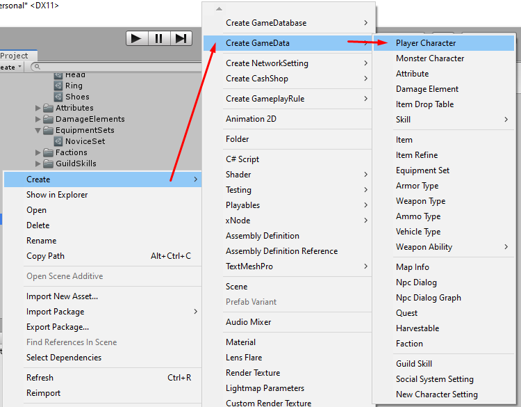
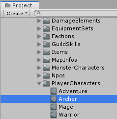
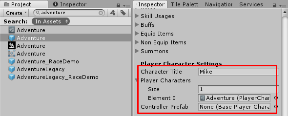
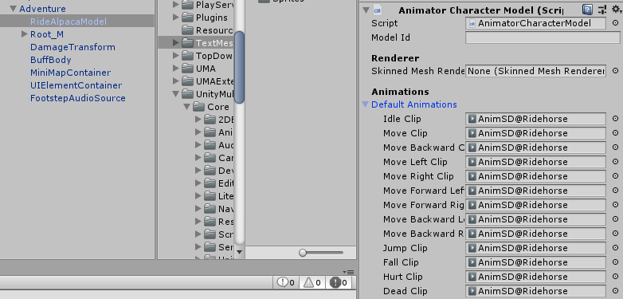
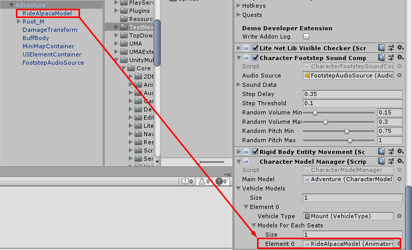

# How to create Player Character Entity

Before create new player character entity, you should know about `Player Character` game data first.

### Player Character

You can create player character by right click in `Project` window then select `Create` -> `Create GameData` -> `Item`

After the player character created. Set its name, its name must be unique unlike other data because we're going to use it as data id (*You can change filename later after you have done the setup*)

There are following configs

- `Title` is default title. if you want to set title for specific language you can set it to `Titles`
- `Titles` is language specific titles. You can set title for specific language key, language key must be the key which existed in `Language Manager` -> `Language List`
- `Description` is default description. if you want to set description for specific language you can set it to `Descriptions`
- `Descriptions` is language specific descriptions. You can set description for specific language key, language key must be the key which existed in `Language Manager` -> `Language List`
- `Icon` is icon which represent item appearance
*   `Stats` this is character stats. Its `Base Stats` is amount of stats when character level is 1. Its `Stats Increase Each Level` is amount of stats that will be increased when character level > 0.
*   `Attributes` this is character attributes. You have to set [attribute](pages/104-character-stats-and-relates-data?id=attribute ':target=__blank') which you want to increase then its `Base Amount` is amount of attributes when character level is 1. Its `Amount Increase Each Level` is amount of attributes that will be increased when character level > 0.
*   `Resistances` this is character resistances. You have to set [damage element](pages/104-character-stats-and-relates-data?id=damage-element ':target=__blank') which you want to increase then its `Base Amount` is amount of resistances when character level is 1. Its `Amount Increase Each Level` is amount of resistances that will be increased when character level > 0.
*   `Armors` this is character armors. You have to set [damage element](pages/104-character-stats-and-relates-data?id=damage-element ':target=__blank') which you want to increase then its `Base Amount` is amount of armors when character level is 1. Its `Amount Increase Each Level` is amount of armors that will be increased when character level > 0.
*   `Skill Levels` an skills which character can level-up to use and its start level when create new character.
*   `Right Hand Equip Item` item which character will equipped when create new character.
*   `Left Hand Equip Item` item which character will equipped when create new character.
*   `Armor Items` item which character will equipped when create new character.
*   `Start Map` map which character will spawn when create new character. If this is empty, it will use first map in database.

* * *

If your project is 3D game, you have to drag skinned mesh to empty scene then add `Player Character Entity` component. If your project is 2D, you can create empty game object then add `Player Character Entity` component.

Then set an transforms / containers

*   `Camera Target Transform` this is transform for position which camera will look at and follow while playing in TPS view mode. You may use added child transform and adjust its position to center of the character. If this is empty (None) it will use entity's transform.
*   `Fps Camera Target Transform` this is transform for position which camera will look at and follow while playing in FPS view mode. You may use added child transform and adjust its position to center of the character. If this is empty (None) it will use entity's transform.
*   `Combat Text Transform` this is transform where it will instantiates an damage texts, HP recovery texts and so on, You may use added child transform and adjust its position to center of the character. If this is empty (None) it will use entity's transform.
*   `Opponent Aim Transform` this is transform where other characters will aim to while attacking, You may use added child transform and adjust its positionto  center of the character. If this is empty (None) it will use `Combat Text Transform`.
*   `Melee Damage Transform` this is transform where it will applying melee damage and find hitting character to apply damages later, You may use added child transform and adjust its position to center of the character. If this is empty (None) it will use entity's transform.
*   `Missile Damage Transform` this is transform where it will applying missile damage and find hitting character to apply damages later, You may use added child transform and adjust its position to center of the character. If this is empty (None) it will use `Melee Damage Transform`. This can be overrided by `Equipment Entity` -> `Missile Damage Transform`.
*   `Character UI Transform` this is transform where it will instantiates an UIs which relates to character such as character name, guild name, HP gage, MP gage and so on, You may use added child transform and adjust its position to center of the character. If this is empty (None) it will use entity's transform.
*   `Mini Map UI Transform` this is transform where it will instantiates mini-map UIs and also set its layer to MiniMap, You may use added child transform and adjust its positionto  center of the character. If this is empty (None) it will use entity's transform.
*   `Character Title` is title which showing in character create scene.
*   `Player Characters` list of `Player Character` data which showing in character create scene which allow players to select. You can assume that this is character classes. **This is important you must have at least 1 `Player Character` in this list**.

* * *

Then setup character model component based on dimension (2D or 3D) and animation type.

## 3D Character Model

*   **[Playable CharacterModel](pages/149-playable-character-model ':target=__blank')**, this character model is using [playable graph](https://docs.unity3d.com/Manual/Playables-Graph.html) to play animations, its performance is better than `Animator Character Model`. Its state settings can be set in components settings only, cannot set state settings in `Animtor` window like `Animator Character Model`.
*   **[Animator Character Model](pages/108-animator-character-model ':target=__blank')**, This character model will support **[Mechanim Animation System](https://docs.unity3d.com/Manual/AnimationOverview.html ':target=__blank')** only, it's using pre-made animator controller then override it at runtime to change animation but it's allow to make custom animator controller too with some conditions.
*   **[Animation Character Model](pages/107-animation-character-model ':target=__blank')**, This character model will support **[Legacy Animation System](https://docs.unity3d.com/Manual/Animations.html ':target=__blank')** only.

## 2D Character Model

*   **[Character Model 2D](pages/109-character-model-2d ':target=__blank')**, This is character model for 2D game, it's use `Animation Clip 2D` to manage animation's frames
### Animation while mount

When add `Player Character Entity` to game object you will see `Character Model Manager`, which will manage animation specific by `Vehicle Type` and `Seat`.

If you want to make them play animation while mount horse correctly, you have to add new character model component for handle that animations. I recommend to create new child transform then add that component for ease of management.

 Then back to character entity. In `Character Model Manager` there is `Vehicle Models` add new entry for specific `Vehicle Type` and set `Models For Each Seats` by the new character model that mentioned above.

* * *

Then setup entity movement component based on dimension (2D or 3D) and animation type.

## 3D Entity Movement

*   **Character Controller Entity Movement** It uses Unity's [Character Controller](https://docs.unity3d.com/ScriptReference/CharacterController.html) for movement.
*   **Rigid Body Entity Movement** It uses Unity's [Open Character Controller](https://github.com/Unity-Technologies/Standard-Assets-Characters) which is uses kinematic rigid body for movement.
*   **Legacy Rigid Body Entity Movement** It uses Unity's [Rigidbody](https://docs.unity3d.com/ScriptReference/Rigidbody.html) (non-kinematic) for movement.
*   **Nav Mesh Entity Movement** It uses Unity's [NavMeshAgent](https://docs.unity3d.com/ScriptReference/AI.NavMeshAgent.html) for movement, so you cannot controller your character to jump or swim. It made for point click games.

## 2D Entity Movement

*   **Rigid Body Entity Movement 2D** For 2D games, there is only one built-in entity movement, if you want to use another entity movement which integrates [A* Pathfinding Project](https://arongranberg.com/astar). You can get it from: [UnityMultiplayerARPG_2DAI](https://github.com/insthync/UnityMultiplayerARPG_2DAI).

After setup entity movement, then adjust colliders fit to character

* * *

After finish the setup, drag it to `Project` window to make prefab then add it to [game database](pages/103-game-database.md). If you're using `Resources Folder Game Database` as your [game database](pages/103-game-database.md), you must put it in `Resources` folder.