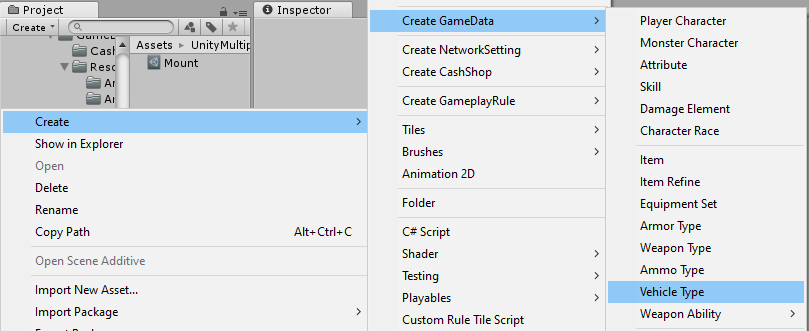
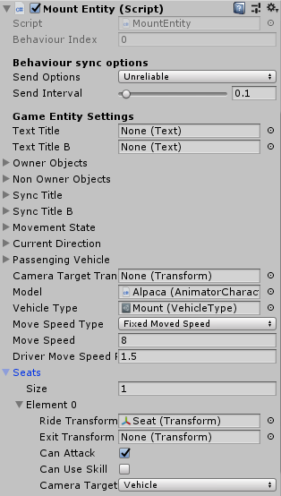

# How to create Vehicle Entity

To create new mount, you have to prepare vehicle type, which made for character animtion specification while passenging vehicle, you can create new vehicle type by:

- Right click on `Project` panel
- Choose `Create` -> `Create Game Data` -> `Vehicle Type`

* * *

Then prepare mount entity, it's like when you prepare character entity, you have to drag skinned mesh to empty scene then add `Mount Entity` component. If your project is 2D, you can create empty game object then add `Mount Entity` component.

Then set created `Vehicle Type` to `Mount Entity` -> `Vehicle Type` field.

Then setup `Seats`, it must have at least 1 seat. Each seat you can set following options:

- `Passenging Transform` where character position will be while passenging the vehicle.
- `Exit Transform` where character position will be when exit from vehicle.
- `Can Attack`, if this is `TRUE` character will able to attack while passenging this vehicle in this seat.
- `Can Use Skill`, if this is `TRUE` character will able to use skill while passenging this vehicle in this seat.
- `Camera Target`, this is target for camera while character passenging this vehicle.

And set other options as you wish.

* * *

Then setup character model component based on dimension (2D or 3D) and animation type.

## 3D Character Model

*   **[Playable CharacterModel](pages/149-playable-character-model ':target=__blank')**, this character model is using [playable graph](https://docs.unity3d.com/Manual/Playables-Graph.html) to play animations, its performance is better than `Animator Character Model`. Its state settings can be set in components settings only, cannot set state settings in `Animtor` window like `Animator Character Model`.
*   **[Animator Character Model](pages/108-animator-character-model ':target=__blank')**, This character model will support **[Mechanim Animation System](https://docs.unity3d.com/Manual/AnimationOverview.html ':target=__blank')** only, it's using pre-made animator controller then override it at runtime to change animation but it's allow to make custom animator controller too with some conditions.
*   **[Animation Character Model](pages/107-animation-character-model ':target=__blank')**, This character model will support **[Legacy Animation System](https://docs.unity3d.com/Manual/Animations.html ':target=__blank')** only.

## 2D Character Model

*   **[Character Model 2D](pages/109-character-model-2d ':target=__blank')**, This is character model for 2D game, it's use `Animation Clip 2D` to manage animation's frames
* * *

Then setup entity movement component based on dimension (2D or 3D) and animation type.

## 3D Entity Movement

*   **Character Controller Entity Movement** It uses Unity's [Character Controller](https://docs.unity3d.com/ScriptReference/CharacterController.html) for movement.
*   **Rigid Body Entity Movement** It uses Unity's [Open Character Controller](https://github.com/Unity-Technologies/Standard-Assets-Characters) which is uses kinematic rigid body for movement.
*   **Legacy Rigid Body Entity Movement** It uses Unity's [Rigidbody](https://docs.unity3d.com/ScriptReference/Rigidbody.html) (non-kinematic) for movement.
*   **Nav Mesh Entity Movement** It uses Unity's [NavMeshAgent](https://docs.unity3d.com/ScriptReference/AI.NavMeshAgent.html) for movement, so you cannot controller your character to jump or swim. It made for point click games.

## 2D Entity Movement

*   **Rigid Body Entity Movement 2D** For 2D games, there is only one built-in entity movement, if you want to use another entity movement which integrates [A* Pathfinding Project](https://arongranberg.com/astar). You can get it from: [UnityMultiplayerARPG_2DAI](https://github.com/insthync/UnityMultiplayerARPG_2DAI).

After setup entity movement, then adjust colliders fit to character

* * *

After finish the setup, drag it to `Project` window to make prefab then add it to [game database](pages/103-game-database.md). If you're using `Resources Folder Game Database` as your [game database](pages/103-game-database.md), you must put it in `Resources` folder.