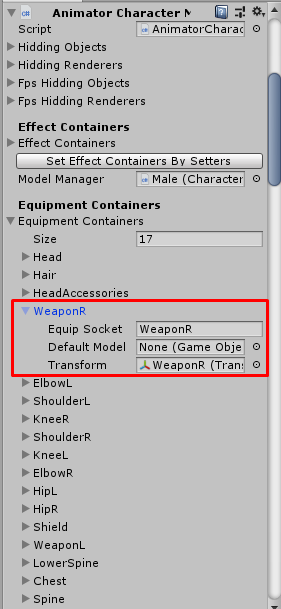
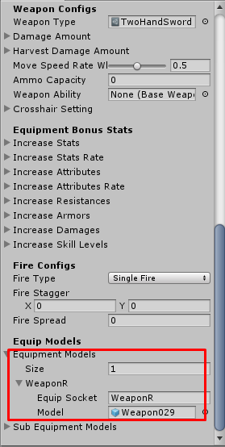

# Checklist for equipment items

When you created the equipment item and want to make the character attach or change model when equip the item, you have to do following this guide:

- Prepare character model's equipment container for specific equipment model location. The character model component will have a `Equipment Containers` setting, which you can set `Equip Socket` for specific equipment model location. When character equip the item, it will instantiate equipment model to `Transform` as a child.

- Prepare item's equipment model for specific equipment model location. The item game data will have a `Equipment Models` setting, which you can set `Equip Socket` for specific equipment model location. When character equip the item, it will instantiate `Model` to character model's equipment transform.

So the key which makes it can instantiate model to transform correctly is `Equip Socket`. It must be the same key in character model → `Equipment Containers` setting and item → `Equipment Models` setting.

* * *

## Skinned mesh equipment model

If equipment model is skinned mesh which will use the same bones with character model. You can set any transform (but must be a child transform of character model) to character model's equipment container transform, it will instantiating the model to that transform then set bones from character model to equipment model.

* * *

## Different equipment models for different characters

If you make 2 base characters, male and female and want to make it instantiate different equipment models for each character. You can set different keys for male and female then uses both keys in item settings which different models. For example:

- `Male` character model has an equipment container with key `Armor(M)`
- `Female` character model has an equipment container with key `Armor(F)`
- `Armor` item has equipment models with key `Armor(M)` and `Armor(F)`, they've different models.
- Then when `Male` character equip `Armor` item, it will instantiate `Armor(M)` model to `Armor(M)` container.
- And when `Female` character equip `Armor` item, it will instantiate `Armor(F)` model to `Armor(F)` container.