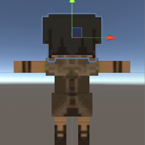

# Animator Character Model

This component working by create [Animator Override Controller](https://docs.unity3d.com/Manual/AnimatorOverrideController.html) at runtime based on `Animator Controller` which set to `Animator Controller` field. Then when character change weapon it can change animation set (idle, move, dead and other animations) based on clip's names which set to `Animator Controller's states`.

To setup this component, you should learn about [Mechanim Animation System](https://docs.unity3d.com/Manual/AnimationOverview.html) and [Animation Clip](https://docs.unity3d.com/Manual/AnimationClips.html).

* * *

You can prepare it after prepared `Character Entity` then add `Playable Character Model` component, then setup following settings:

### Hidding Objects

This is a list of game objects which will be deactivated when hidden, character model can be hidden in shooter game mode when zooming with guns.

You can set just root of bone here because when root deactivated, all equipment models that are its children will be hidden too.

* * *

### Effect Containers

Effect container was made to instantiates effects (particles, sfx and so on) to difference positions, some buff effects may instantiates at character hands, some effects may instantiates at character body.

To set a container, you have to create empty game object then set its position to where you wish the effects to instantiates.

For example, `Body` container's position will be located at center of character like this

Then drag it to `Effect Containers` and set `Effect Socket`

That is it, but there is another way to setup effect container by using `Effect Container Setter`

You have to create empty game object, set its position, then you have to set its name as `Effect Socket` and attach `Effect Container Setter` to the game object

Then go back to character model and press on `Set Effect Containers by Setters` button

Finally, the effect container has been set

* * *

### Equipment Containers

Equipment container was made to instantiates equipments (helment, armor, sword and so on) to difference positions, some equipments may instantiates at character hands, some equipments may instantiates at character body.

To set a container, you have to create empty game object then set its position to where you wish the equipments to instantiates.

For example, `Head` container's position will be located at character head bone like this

Then drag it to `Equipment Containers`, set `Equip Socket` and set `Default Model` it is the model which will be deactivated when equip the equipment and activated when unequip the equipment, for example `Hair` is default model it will be deactivated to hide it when equip `Helmet`

That is it, but there is another way to setup equipment container by using `Equipment Container Setter`

You have to create empty game object, set its position, then you have to set its name as `Equipment Socket` and attach `Equipment Container Setter` to the game object

Then go back to character model and press on `Set Equipment Containers by Setters` button

Finally, the equipment container has been set

*(Or use `Character Entity Creator` tool which can be accessed from menu `MMORPG KIT` -> `Character Entity Creator`)*

* * *

## Animation Clip Settings

Before looking into animation clip settings list, you should to know about `Action Animation` settings

### Anim State

*   `Clip` set `Animation Clip` which you want it to play when doing action.
*   `Anim Speed Rate` this is value which will be used to multiply with animation clip playing speed. If this <= 0, it will not be used to calculate with animation speed multiplier.
*   `Transition Duration` this is duration to transition from previos state to this state. If this <= 0, it will use default transition duration setting from model component.

### Action State

*   `Clip` set `Animation Clip` which you want it to play when doing action.
*   `Avatar Mask` this is [avatar mask](https://docs.unity3d.com/Manual/class-AvatarMask.html) setting which will be set to action layer when playing action animations (attacking/skill using). If this is `null`, it will use default avatar mask setting from model component.
*   `Anim Speed Rate` this is value which will be used to multiply with animation clip playing speed. If this <= 0, it will not be used to calculate with animation speed multiplier.
*   `Transition Duration` this is duration to transition from previos state to this state. If this <= 0, it will use default transition duration setting from model component.

### Action Animation

*   `State` it's action state settings.
*   `Trigger Duration Rates` this will be in used with attacking/skill using animations, This is rate of total animation duration at when it should hit enemy or apply skill.
*   `Duration Type` there are 2 types: `By Clip Length` and `By Fixed Duration`. for the first one, next action will be able to play after animation clip length duration. for the second one, next action will be able to play after `Fixed Duration` duration.
*   `Extra Duration` some duration which will sum with animation clip length or `Fix Duration Value`, may use it to play idle animation before next attack animation.
*   `Audio Clips` an audio clips which will play randomly when trigger an action events.

* * *

All animation clip settings contains:

*   `Action Avatar Mask` it is a default action avatar mask setting which will be used when `avatarMask` in action state settings is `null`.
*   `Transition Duration` it is a default transition duration which will be used when `transitionDuration` in state settings is <= 0, it will use this value.
*   `Default Animations` this is contains default animation clips and action animations
*   `Weapon Animations` each of this is contains animation clips and action animations for specific `Weapon Type`.
*   `Skill Animations` each of this is contains skill cast clip and activate skill action animation for specific `Skill`.
*   `Animator` set `Animator` which will be used to handle animation playing here.

* * *

After done you can save it as a prefab (drag to any folder in `Project` window).