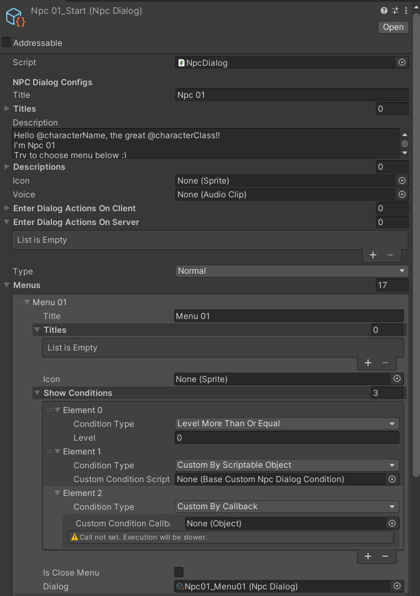
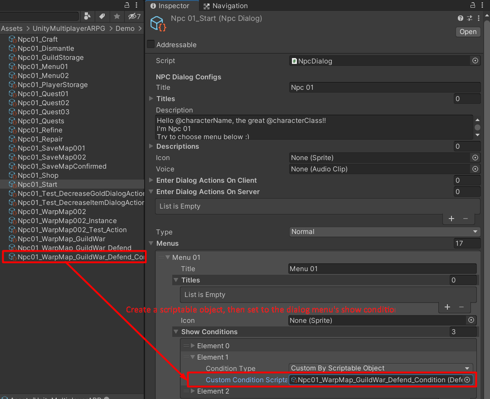
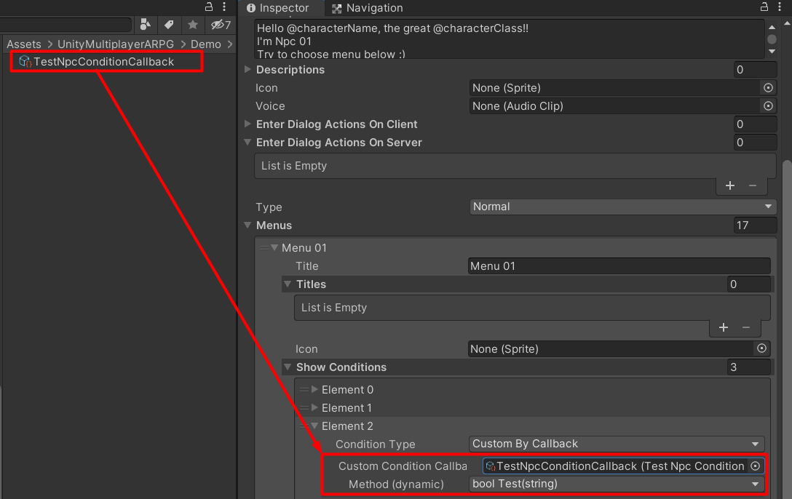

# NPC Dialog Menu Conditions

You can set condition to show menu in NPC dialog -> `Menus` -> (menu entry) -> `Show Conditions`

It has following built-in conditions are:

- `LevelMoreThanOrEqual`, the menu will be shown if character's level >= condition's `level` setting.
- `LevelLessThanOrEqual`, the menu will be shown if character's level <= condition's `level` setting.
- `QuestNotStarted`, the menu will be shown if the quest which set to `quest` setting, is not started by character.
- `QuestOngoing`, the menu will be shown if the quest which set to `quest` setting, is on going.
- `QuestTasksCompleted`, the menu will be shown if the quest's tasks for quest which set to `quest` setting, are completed.
- `QuestCompleted`, the menu will be shown if the quest which set to `quest` setting, is on completed.
- `FactionIs`, the menu will be shown if character's faction is the same as `faction` setting.
- `PlayerCharacterIs`, the menu will be shown if character's class is the same as `playerCharacter` setting.

You also can set custom conditions too, there are 2 ways:

## Custom By Scriptable Object

This way you must create a new class based on `BaseCustomNpcDialogCondition` which is scriptable object class, implement condition in `IsPass` function.

The `IsPass` function has a `IPlayerCharacterData player` parameter, it will pass reference to player who enter the NPC dialog, so we can use player data to setup condition to show the dialog's menu, return `TRUE` if player is pass the condition.

*This function can be async function, so we can make it connect to external services to validate some data, you can look at guild war's `DefenderGuildNpcDialogCondition` script as an example.*

To use it, you must create a new scriptable object of your class, then set to dialog menu show conditions' `customConditionScriptableObject` field.

## Custom By Callback

This way you must create a new component or scriptable object class, which have any functions that has a string parameter and return boolean (such as `public bool AlwaysPass(string playerId) { return true; }`), it will pass player's ID to the parameter, so we can use it to find a player, and use the player data to setup condition to show the dialog's menu.

*It cannot be an async functions like we do to `Custom By Scriptable Object`.*

Then, to use it you have to attach the component to prefab or create a new scriptable object, then set reference of the game object or component or scriptable object to dialog menu show conditions' `customConditionCallback` field and choose the function which you want to use as a condition.

